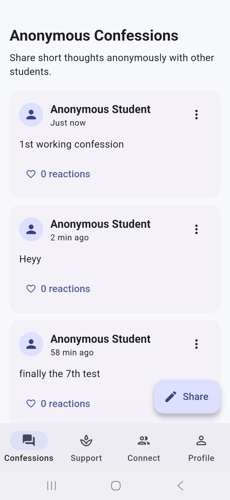
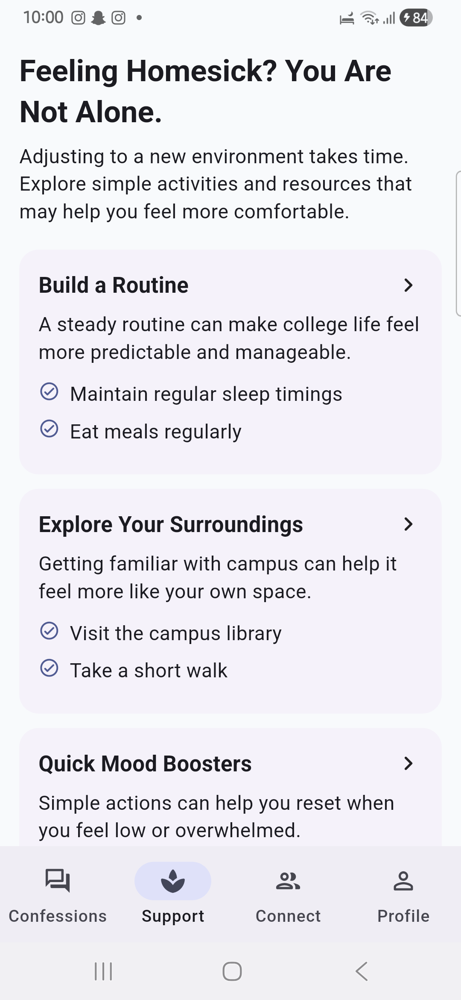
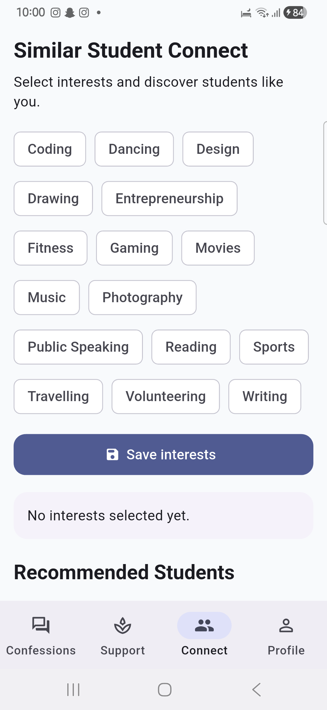
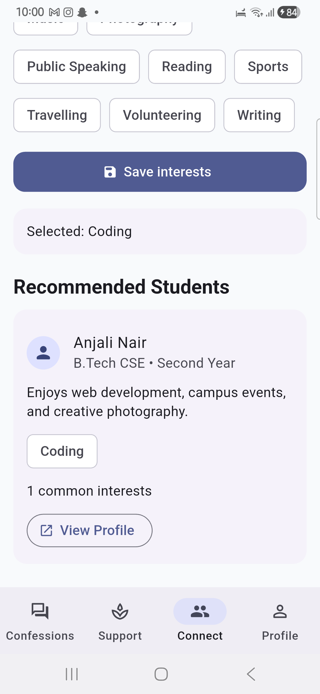
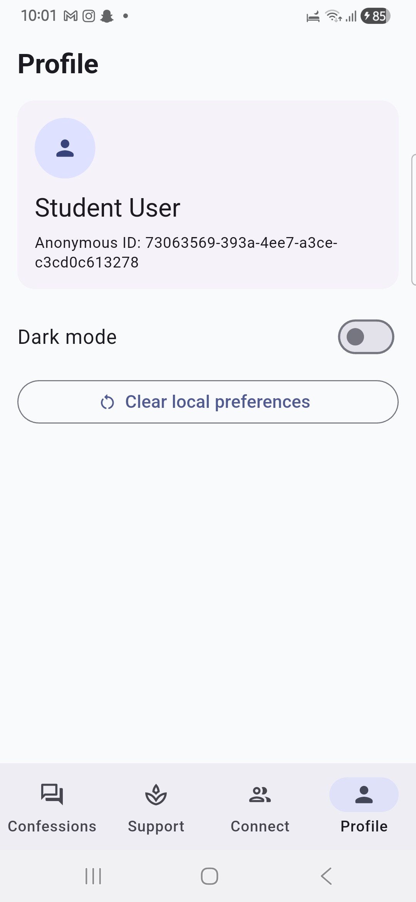

# Student Companion

## Overview

Student Companion is a student-support app for college students living away from home. It combines anonymous confessions, homesickness support resources, and interest-based student discovery in one Flutter experience backed by an Express API and Neon PostgreSQL.

The app uses a local anonymous device identity so students can interact without account signup while still supporting confession ownership, reactions, reports, selected interests, recommendations, and connect requests.

## Features

- Anonymous confessions feed with create, react, unreact, report, and owner delete actions.
- Homesickness support resources with student-friendly guidance and safety messaging.
- Interest selection for anonymous users.
- Recommended student discovery based on shared interests.
- Student profile details and connect request flow.
- Provider-based Flutter state management with loading, error, and empty states.
- Centralized API base URL configuration through `ApiConfig`.

## Architecture

```text
Flutter app
  -> screens render feature flows
  -> providers manage loading, error, and feature state
  -> services call REST endpoints using ApiConfig.baseUrl
  -> SharedPreferences stores anonymous device identity

Express backend
  -> routes expose /api endpoints
  -> controllers validate input and run SQL queries
  -> Neon PostgreSQL stores app data
```

## Project Structure

```text
student-companion/
  backend/
    database/        SQL schema and seed data
    scripts/         Database setup helper
    src/
      config/        Database connection
      controllers/   API request handlers
      middleware/    Error handling and rate limiting
      routes/        Express route definitions
      utils/         Shared validators
  mobile/
    lib/
      core/          Config, constants, theme, utilities
      models/        API data models
      providers/     Provider state classes
      screens/       Feature screens
      services/      REST API clients and local preferences
    test/            Flutter widget tests
  screenshots/       App screenshots
  apk/               Optional copy location for release APK
```

## Tech Stack

- Flutter
- Provider
- SharedPreferences
- Node.js
- Express
- Neon PostgreSQL

## API Endpoints

```text
GET    /api/health
GET    /api/confessions
POST   /api/confessions
POST   /api/confessions/:id/react
DELETE /api/confessions/:id/react
POST   /api/confessions/:id/report
DELETE /api/confessions/:id
GET    /api/interests
POST   /api/user-interests
GET    /api/students/recommended?anonymousDeviceId=<id>
GET    /api/students/:id
POST   /api/connect-requests
GET    /api/support-resources
```

## Database Design

The Neon PostgreSQL schema includes:

- `confessions`: anonymous confession content, reaction counts, ownership, and timestamps.
- `confession_reactions`: tracks one reaction per anonymous device per confession.
- `confession_reports`: stores reports for moderation review.
- `students`: seeded student profile data used for recommendations.
- `interests`: selectable interest options.
- `student_interests`: links seeded students to interests.
- `anonymous_user_interests`: stores selected interests for each anonymous device.
- `connect_requests`: records connection requests between anonymous users and students.
- `support_resources`: homesickness and wellness resource cards.

## Setup Instructions

Create `backend/.env` from `backend/.env.example` and add your Neon connection string:

```env
PORT=4242
DATABASE_URL="your_neon_postgresql_connection_string"
DATABASE_URL_DIRECT=
```

Install and start the backend:

```bash
cd backend
npm install
npm run db:setup
npm run dev
```

Run the Flutter app:

```bash
cd mobile
flutter pub get
flutter run --dart-define=API_BASE_URL=http://<PC_LOCAL_IP>:4242
```

Common API base URLs:

```text
Android emulator: http://10.0.2.2:4242
Chrome/Windows:   http://localhost:4242
Physical phone:   http://<PC_LOCAL_IP>:4242
```

Build a release APK:

```bash
cd mobile
flutter clean
flutter pub get
flutter analyze
flutter test
flutter build apk --release --dart-define=API_BASE_URL=http://<PC_LOCAL_IP>:4242
```

Expected APK path:

```text
mobile/build/app/outputs/flutter-apk/app-release.apk
```

## Screenshots

### Anonymous Confessions



### Homesickness Support



### Similar Student Connect



### Student Recommendations



### Profile



## Future Scope

- Add authenticated student accounts.
- Add in-app messaging after connect requests are accepted.
- Add moderation tools for reported confessions.
- Add campus-specific counselling and emergency resources.
- Improve recommendation matching using shared interests and activity patterns.

## Security Notes

Never commit:

- `.env`
- Neon database URLs
- API keys
- Passwords
- Tokens
- Build secrets

Only `.env.example` should be public. The `.gitignore` excludes `.env`, `node_modules/`, Flutter build output, and local generated files.

## License

This project is licensed under the terms in [LICENSE](LICENSE).
